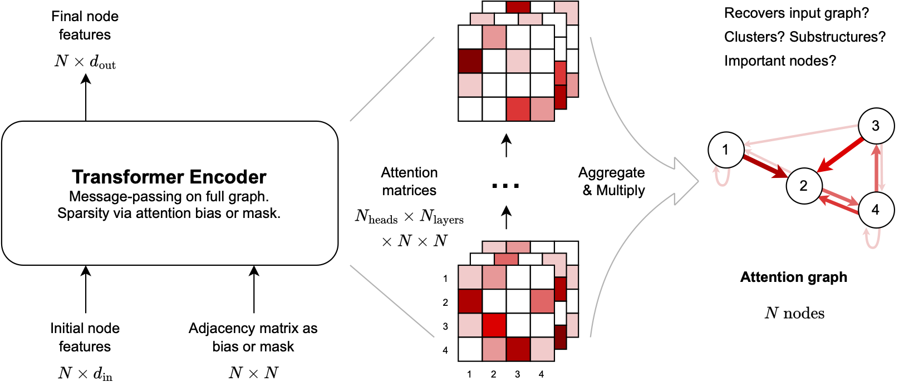
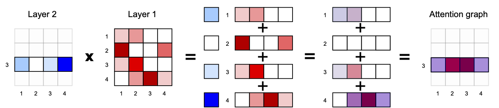
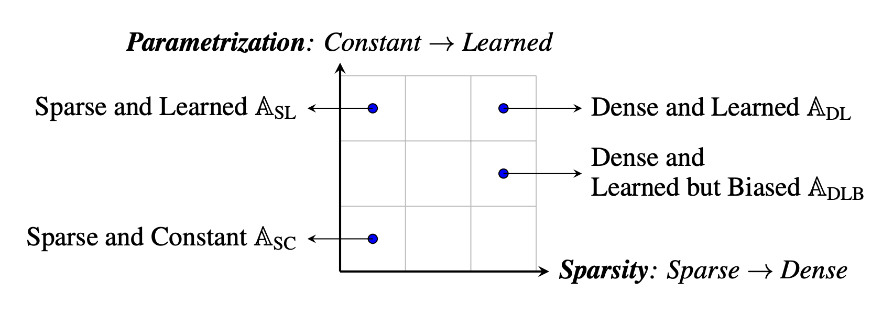
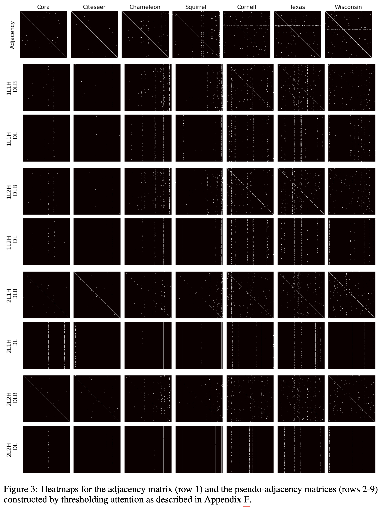

# Towards Mechanistic Interpretability of Graph Transformers via Attention Graphs

[](https://arxiv.org/abs/2502.12352)
[](https://drive.google.com/drive/folders/1rCwxa3mjwZ9m24sl7gttgiJ-dzUZoNt1?usp=sharing)
[](https://github.com/batu-el/understanding-inductive-biases-of-gnns/blob/main/presentation.pdf)

## Abstract
We introduce Attention Graphs, a new tool for mechanistic interpretability of Graph Neural Networks (GNNs) and Graph Transformers based on the mathematical equivalence between message passing in GNNs and the self-attention mechanism in Transformers. Attention Graphs aggregate attention matrices across Transformer layers and heads to describe how information flows among input nodes. Through experiments on homophilous and heterophilous node classification tasks, we analyze Attention Graphs from a network science perspective and find that: (1) When Graph Transformers are allowed to learn the optimal graph structure using all-to-all attention among input nodes, the Attention Graphs learned by the model do not tend to correlate with the input/original graph structure; and (2) For heterophilous graphs, different Graph Transformer variants can achieve similar performance while utilising distinct information flow patterns.


## Pipeline


## Method


## Models


## Information Flow Patterns


## Citation
```bibtex
@article{el2025towards,
  title={Towards Mechanistic Interpretability of Graph Transformers via Attention Graphs},
  author={El, Batu and Choudhury, Deepro and Li{\`o}, Pietro and Joshi, Chaitanya K},
  journal={arXiv preprint arXiv:2502.12352},
  year={2025}
}
```