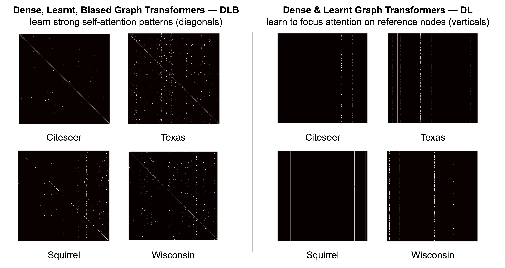

# Towards Mechanistic Interpretability of Graph Transformers via Attention Graphs

[](https://arxiv.org/abs/2502.12352)
[](https://drive.google.com/drive/folders/1rCwxa3mjwZ9m24sl7gttgiJ-dzUZoNt1?usp=sharing)
[](https://github.com/batu-el/understanding-inductive-biases-of-gnns/blob/main/presentation.pdf)

> Batu El*, Deepro Choudhury*, Pietro Liò, Chaitanya K. Joshi. Towards Mechanistic Interpretability of Graph Transformers via Attention Graphs. arXiv preprint, 2025.


## Abstract

We introduce **Attention Graphs**, a new tool for mechanistic interpretability of Graph Neural Networks (GNNs) and Graph Transformers based on the mathematical equivalence between message passing in GNNs and the self-attention mechanism in Transformers. Attention Graphs aggregate attention matrices across Transformer layers and heads to describe how information flows among input nodes. Through experiments on homophilous and heterophilous node classification tasks, we analyze Attention Graphs from a network science perspective and find that: (1) When Graph Transformers are allowed to learn the optimal graph structure using all-to-all attention among input nodes, the Attention Graphs learned by the model do not tend to correlate with the input/original graph structure; and (2) For heterophilous graphs, different Graph Transformer variants can achieve similar performance while utilising distinct information flow patterns.


## Attention Graphs pipeline

- *Left:* Graph Neural Networks are equivalent to Transformers operating on fully connected graphs. 
- *Middle:* The attention matrices at each layer and each head in the Transformer tell us how information flows among input tokens. 
- *Right:* The attention matrices can be aggregated across layers and heads to construct a directed Attention Graph of information flow in the GNN/Graph Transformer. **We can study Attention Graphs from a network science perspective to mechanistically understand the algorithms learned by GNNs and Graph Transformers.**


We aggregate attention across Transformer layers by **matrix multiplication**. Attention matrices from successive layers are combined to capture indirect information flow. For node i, row i in the attention matrix A_L2 represents how much it attends to each intermediate node j. Each row j in A_L1 captures how those intermediate nodes attend to other nodes k. Matrix multiplication A_L2 . A_L1 combines these patterns, revealing how node i indirectly attends to node k through intermediate nodes j


## Graph Transformer design space

We studied a design space of Graph Transformers based on two key dimensions: (1) sparsity of attention (sparse vs. dense) and (2) parametrization of attention (constant vs. learned).


## Different inductive biases lead to distinct algorithmic strategies

- We plot quasi-adjacency matrices derived from Attention Graphs for DLB and DL models across different datasets for the 2-layer 2-head configuration. Black squares indicate no edges in the thresholded Attention Graph, while white squares indicate edges. 
- DLB models exhibit strong self-attention patterns (diagonal lines), suggesting they focus on initial node features rather than aggregating information from neighbors. 
- DL models develop reference nodes (vertical lines) that receive high attention from all other nodes, suggesting a classification algorithm based on comparing nodes against these references.




## Citation
```bibtex
@article{el2025towards,
  title={Towards Mechanistic Interpretability of Graph Transformers via Attention Graphs},
  author={El, Batu and Choudhury, Deepro and Li{\`o}, Pietro and Joshi, Chaitanya K},
  journal={arXiv preprint arXiv:2502.12352},
  year={2025}
}
```